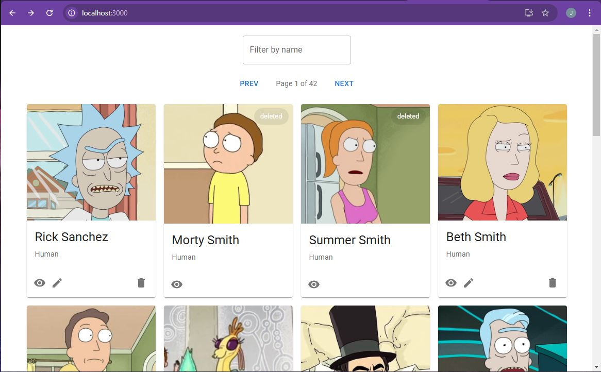
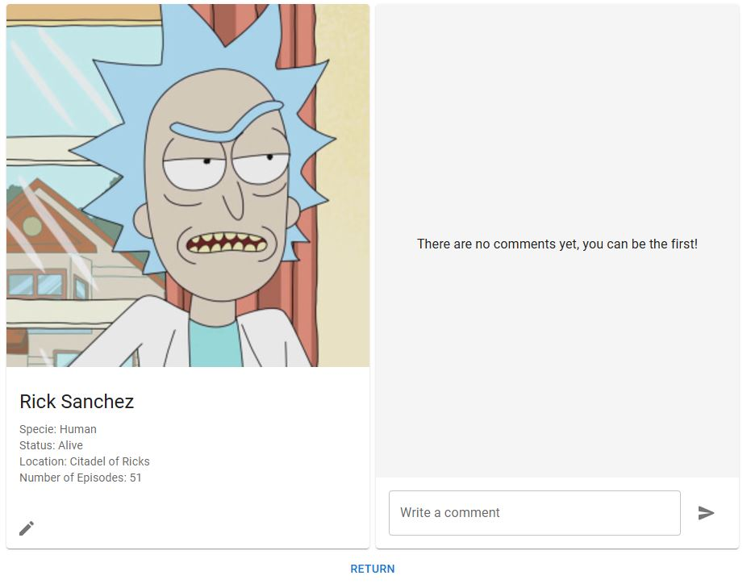
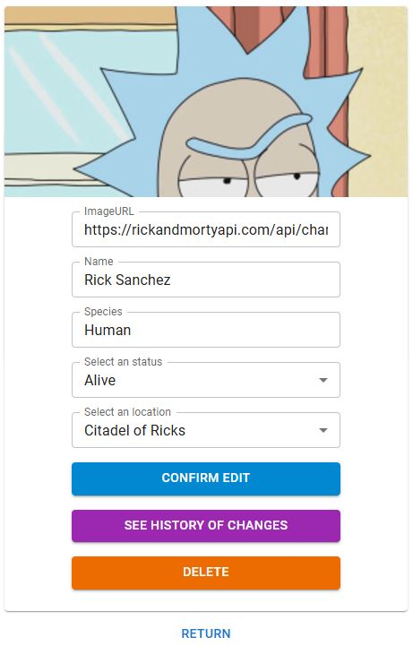

## Project's purpose

This project implements features for a Single Page Application (SPA) using TypeScript. The goal is to simulate production-ready conditions, prioritizing functionality, performance, and usability.

Using the Rick and Morty API, along with json-server for local data persistence, the project includes the following key features:

- UI: The app utilizes MUI for consistent styling and improved accessibility, along with react-hook-form for form handling and react-query for data fetching.
- Editing and Deleting Characters: Users can modify character attributes, which are reflected both in the character list and detail views. Deleted characters remain in the list, labeled as deleted, and cannot be edited or commented on.
- Modification History: Each character’s complete modification history is available, except for deleted characters.
- Comments: Users can add and view comments on character details, enhancing user interaction (excluding deleted characters).

The project provides a flexible and robust SPA with a focus on usability, showcasing API integration, client-side data management, and user interactions.

## DEV

### `npm start`: Uses the URLs specified in the `.env` file.
### `npm run server` Run this command in a separate terminal to start the simulated backend.

Runs the app in the development mode.\
Open [http://localhost:3000](http://localhost:3000) to view it in the browser.

# STRATEGIES

### Api middleware

This middleware manages data through the following flow:

- GET: Handles requests for character lists and individual characters.
- PUT: Used for updates, tracking history changes, deletions, and managing comments.
- json-server:
  - Contains three collections: character (for updates and deletions), history (for change tracking), and comment.
  - character and history collections store partial data to avoid redundancy.

### Site Reliability
In case `json-server` is unavailable:
- The Characters page takes info from rickandmortyapi.com
- An error 'Please, try again later.' will is display when attempting to modify data (character editing, deletion and comments)

In case `rickandmortyapi.com` is unavailable:
- For a new search query, the Characters page will display 'We are working to enhance our services. Please try again later.'
- For a cached search query, the Characters page will show cached data, managed by `useQuery`.
- Character editing, deletion, and comments functionality will remain operational because `json-server` is running, and any changes will reflect on the Characters page using cached data through `useQuery`.

### Routes
- Searching by browser path or by typing in the searchinput is supported.
- All pages are accessible via browser path.
- The `Edit and History pages` cannot be accessed via browser path if the character has been deleted.

### Extensibility
- History Timestamp: Timestamps can be added to history entries to show the relative time, e.g., "1 day ago." The structure updates from `{keyModified:"value modified"}` to `{keyModified:"value modified", timestamp:21341234444}`
- Comment Timestamp and User: Timestamps and user information can be added to comments in a similar structure to the history entries, such as `{message:"This is a message", timestamp:21341234444, user:"random user"}`

### Possible Improvements and Knowed issues
- Global Toaster Notification (Improvement): Adding a global toaster notification system to display alerts or messages across the application.
- Debounce for Search Input (Improvement): Implementing debounce functionality for the search input to reduce the number of API calls and improve performance.
- Character Name Modification (Known Issue): Modifying a character's name works as expected, but the modified name is not searchable due to the R&M API’s lack of awareness of the updated name.
- Optimize Bundle Size (Improvement): Replace named imports with default imports in Material UI components, as recommended https://mui.com/material-ui/guides/minimizing-bundle-size/
- File and Folder Organization and Names (Known Issue)
Reorganize files and folders to improve project structure and maintainability.

## BUILD

### `npm run build` uses URLs from .env.production
### `npm install -g serve`
### `serve -s build`  serves the static files
### `npm run server` in a separate terminal, to launch the simulated backend.

Runs the app serving static files.\

## Screenshots of the project
### Home

### Character detail

### Character edition
